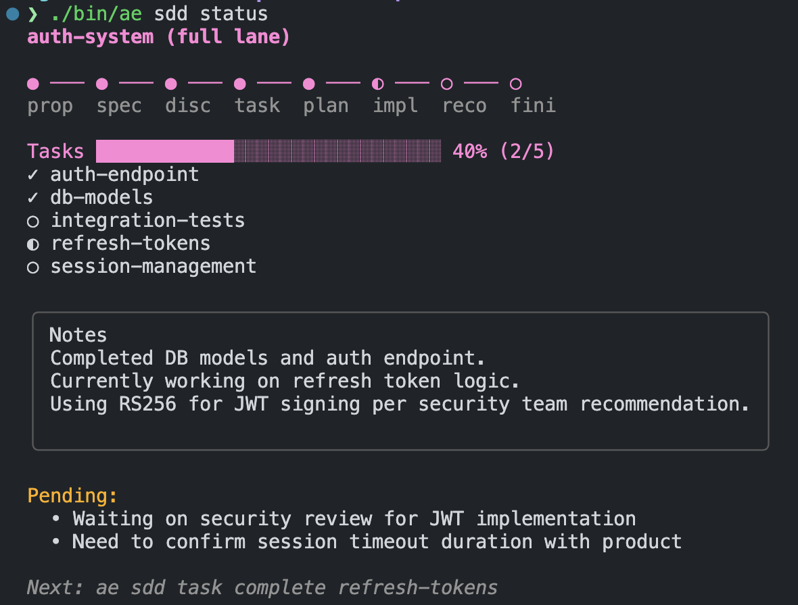

<p align="center">
  <picture>
    <source media="(prefers-color-scheme: dark)" srcset="docs/_media/ae-logo-dark.png">
    <source media="(prefers-color-scheme: light)" srcset="docs/_media/ae-logo-light.png">
    
  </picture>
</p>

<p align="center">
  <strong>Supercharge your AI coding agents with curated commands, skills, and hooks.</strong>
</p>

## Philosophy

Agent Extensions embraces spec-driven development, where specifications are treated as first-class citizens alongside code. Think of specs as source code and your implementation as the compiled binary. Well-curated specs capture intent, constraints, and long-term vision, while the code is simply their executable form.

These extensions are not about completing a single ticket. They are about building products with intention, where every feature traces back to a specification that explains the *why*, not just the *how*. Your AI agents become partners in maintaining this discipline, helping you plan, discover, implement, and reconcile against specs throughout the entire development lifecycle.

## Supported Agents

| Agent | Commands | Skills | Hooks |
|-------|:--------:|:------:|:-----:|
| [Claude Code](https://docs.anthropic.com/en/docs/claude-code/overview) | ✅ | ✅ | 🔜 |
| [Codex](https://github.com/openai/codex) | ✅ | ✅ | ❌ |
| [OpenCode](https://opencode.ai/docs/) | ✅ | ✅ | 🔜 |
| [Augment](https://docs.augmentcode.com/cli/overview) | ✅ | ✅ | ❌ |
| [Cursor](https://www.cursor.com/) | ✅ | ✅ | ❌ |
| [Windsurf](https://windsurf.com/editor) | ✅ | ✅ | ❌ |
| [Cline](https://github.com/cline/cline) | ✅ | ✅ | ❌ |
| [Kilo Code](https://kilocode.ai/) | ✅ | ✅ | ❌ |
| [Droid](https://docs.factory.ai/cli/getting-started/quickstart) | ✅ | ✅ | 🔜 |

## Installation

### Quick Install (Recommended)

```sh
curl -fsSL https://raw.githubusercontent.com/shanepadgett/agent-extensions/main/install.sh | sh
```

### npm / npx

```sh
npx @shanepadgett/agent-extensions
```

Or install globally:

```sh
npm install -g @shanepadgett/agent-extensions
ae
```

### From Source

```sh
git clone https://github.com/shanepadgett/agent-extensions.git
cd agent-extensions
mise run build
./bin/ae
```

## Usage

Run `ae` to start the interactive installer:

```sh
ae
```

### Interactive Mode

1. **Select tools** - Pick which AI agents to configure
2. **Select scope** - Install globally, locally, or both

<p align="center">
  <picture>
    
  </picture>
</p>

### Non-Interactive Mode

```sh
# Install to all tools globally
ae install --tools all --scope global --yes

# Install to specific tools locally
ae install -t claude-code,codex -s local -y

# Uninstall from all tools
ae uninstall --yes
```

## Commands

| Command | Description |
|---------|-------------|
| `ae install` | Install commands and skills for selected tools |
| `ae uninstall` | Remove installed commands and skills |
| `ae list` | Show available content and installation status |
| `ae doctor` | Check configuration health |
| `ae version` | Display version information |

## Release Commit Conventions

This repo uses Release Please and Conventional Commits to automate versioning and release PRs.

- `fix:` bumps patch (`x.y.Z`)
- `feat:` bumps minor (`x.Y.0`)
- `feat!:` or `BREAKING CHANGE:` bumps major (`X.0.0`)

Examples:

```text
fix: handle missing config path
feat: add codex install diagnostics
feat!: change installer config format
```

Non-user-facing changes like `docs:`, `test:`, and `chore:` generally do not trigger a new release version on their own.
