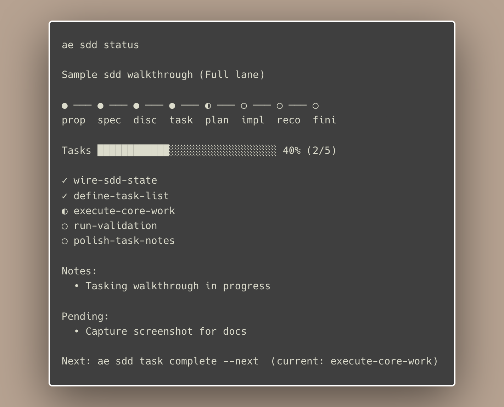

<p align="center">
  <picture>
    <source media="(prefers-color-scheme: dark)" srcset="docs/_media/ae-logo-dark.png">
    <source media="(prefers-color-scheme: light)" srcset="docs/_media/ae-logo-light.png">
    
  </picture>
</p>

<p align="center">
  <strong>Supercharge your AI coding agents with curated skills and hooks.</strong>
</p>

## What This Project Does

Agent Extensions installs curated skills and hooks for supported AI coding agents.

It is designed for two audiences:

- Users who want a fast way to install and manage agent tooling.
- Maintainers who want a predictable release flow across GitHub releases and npm.

## Supported Agents

| Agent | Skills | Hooks |
|-------|:------:|:-----:|
| [Claude Code](https://docs.anthropic.com/en/docs/claude-code/overview) | ✅ | 🔜 |
| [Codex](https://github.com/openai/codex) | ✅ | ❌ |
| [OpenCode](https://opencode.ai/docs/) | ✅ | 🔜 |
| [Augment](https://docs.augmentcode.com/cli/overview) | ✅ | ❌ |
| [Cursor](https://www.cursor.com/) | ✅ | ❌ |
| [Windsurf](https://windsurf.com/editor) | ✅ | ❌ |
| [Cline](https://github.com/cline/cline) | ✅ | ❌ |
| [Kilo Code](https://kilocode.ai/) | ✅ | ❌ |
| [Droid](https://docs.factory.ai/cli/getting-started/quickstart) | ✅ | 🔜 |

## Install

### Quick Install (Recommended)

```sh
curl -fsSL https://raw.githubusercontent.com/shanepadgett/agent-extensions/main/install.sh | sh
```

### npm / npx

```sh
npx @shanepadgett/agent-extensions
```

Or install globally:

```sh
npm install -g @shanepadgett/agent-extensions
ae
```

### From Source

```sh
git clone https://github.com/shanepadgett/agent-extensions.git
cd agent-extensions
mise run build
./bin/ae
```

## Terminal Preview

<p align="center">
  <picture>
    
  </picture>
</p>

## Usage

Run `ae` to start the interactive installer:

```sh
ae
```

### Interactive Mode

1. Select tools to configure.
2. Select install scope (`global`, `local`, or both).

### Non-Interactive Mode

```sh
# Install to all tools globally
ae install --tools all --scope global --yes

# Install to specific tools locally
ae install -t claude-code,codex -s local -y

# Uninstall from all tools
ae uninstall --yes
```

## Commands

| Command | Description |
|---------|-------------|
| `ae install` | Install skills for selected tools |
| `ae uninstall` | Remove installed skills |
| `ae list` | Show available content and installation status |
| `ae doctor` | Check configuration health |
| `ae version` | Display version information |

## Developer Workflow

Prerequisite: install `mise` before running development tasks.

- Install guide: <https://mise.jdx.dev/getting-started.html>

Use `mise run <task>` for day-to-day development:

| Task | Command |
|------|---------|
| Build CLI | `mise run build` |
| Run tests | `mise run test` |
| Lint | `mise run lint` |
| Format | `mise run fmt` |
| Local release check (snapshot) | `mise run release` |

## Release Workflow

Releases are automated with Release Please and conventional commits.

1. Merge feature/fix PRs into `main`.
2. Release Please opens or updates a release PR.
3. Merge that release PR.
4. Auto-tag workflow creates `vX.Y.Z`.
5. Tag triggers publish workflow (GoReleaser assets + npm publish).

`npm/package.json` version must match the tag version; CI enforces this.

## Conventional Commits

This repo uses Release Please and Conventional Commits to automate versioning and release PRs.

- `fix:` bumps patch (`x.y.Z`)
- `feat:` bumps minor (`x.Y.0`)
- `feat!:` or `BREAKING CHANGE:` bumps major (`X.0.0`)

Examples:

```text
fix: handle missing config path
feat: add codex install diagnostics
feat!: change installer config format
```

Non-user-facing changes like `docs:`, `test:`, and `chore:` do not trigger a new release version on their own.
